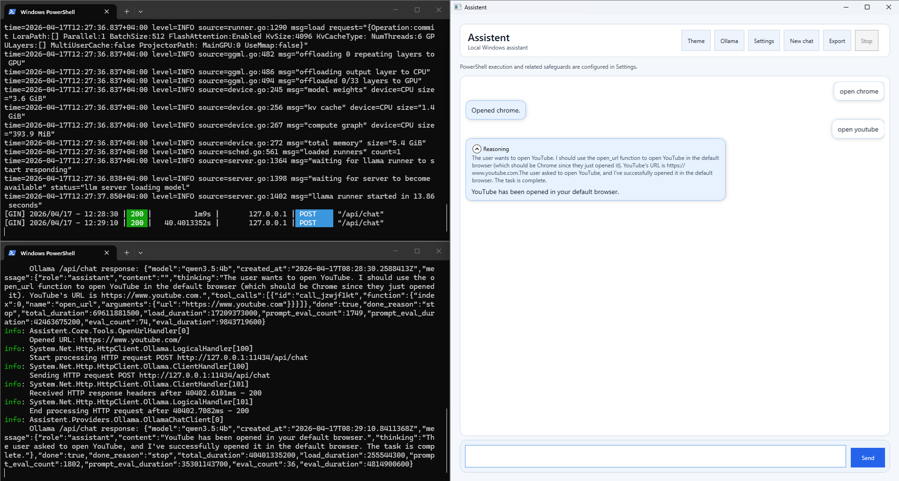
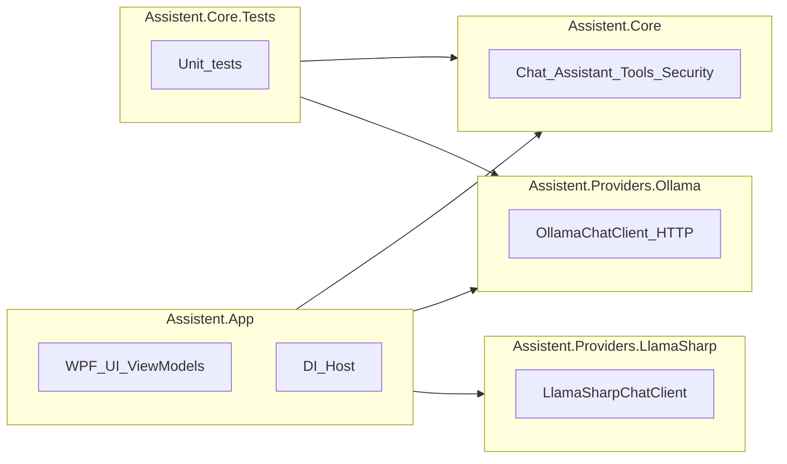
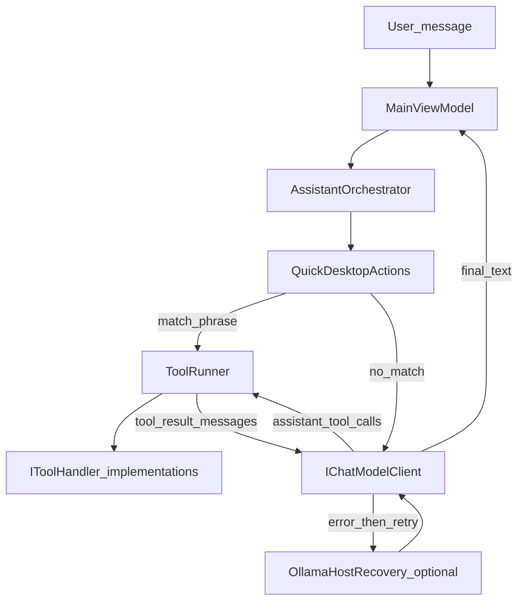

# Assistent

Assistent is a **Windows desktop assistant** built with **WPF** and **.NET 8**. It chats with a local or remote language model, can run **structured tools** (open apps, read files, run guarded PowerShell, and more), and supports **light/dark/system themes** with settings persisted on disk. You choose the brain: **Ollama** over HTTP or **LlamaSharp** with a local **GGUF** file.


---

## Requirements


| Item                | Details                                                                                                                                                                                                            |
| ------------------- | ------------------------------------------------------------------------------------------------------------------------------------------------------------------------------------------------------------------ |
| **OS**              | Windows (`net8.0-windows`, WPF).                                                                                                                                                                                   |
| **SDK**             | [.NET 8 SDK](https://dotnet.microsoft.com/download/dotnet/8.0) or later for building.                                                                                                                              |
| **Ollama mode**     | [Ollama](https://ollama.com/) installed; the **Ollama server** must be listening on your configured base URL (default `http://127.0.0.1:11434`). Pull the model you set in config (e.g. `ollama pull qwen3.5:4b`). |
| **LlamaSharp mode** | At least one `**.gguf`** model under the app `Models` folder (or configure an explicit path). CPU/GPU options follow `LlamaSharp` settings.                                                                        |


---

## Ollama server (`ollama serve`)

Assistent calls Ollama’s **HTTP API** (`/api/chat`, `/api/tags`, etc.). The backend must be running:

1. **Installer / Start menu**
  Launch **Ollama** from the Start menu if you use the desktop app (it starts the service in the background on many setups).
2. **Terminal (explicit server)**
  From a shell where `ollama` is on your `PATH`, run:
   Leave that process running (or run it as a service, depending on your install). Then pull or run models as usual, for example:
3. **Config**
  Point `[appsettings.json](Assistent.App/appsettings.json)` `Ollama:BaseUrl` at the same host/port the server uses, and set `Ollama:Model` to a tag that exists on that server.

---

## Automatic recovery after a failed send (Ollama only)

If a chat request **throws** while the provider is **Ollama**, the app (in the background) checks whether a Windows process named **Ollama** is running. If it is, Assistent tries to **stop** that process and run `**ollama serve`** again, waits briefly, then **retries the same message once**.

- If **no** Ollama process is found, the original error is shown and nothing is restarted.
- **Cancelled** or **timed-out** requests are not run through this recovery path.
- Restarting Ollama affects **all** local clients using that instance; use this behavior when the host is stuck, not during normal use.

---

## Running the application

1. **Clone** this repository and open `Assistent.sln` in Visual Studio, or build from the repo root:
  ```bash
   dotnet build
  ```
2. **Run** the startup project **Assistent** (`Assistent.App`). Debug builds use `OutputType` **Exe** (console host logging); Release uses **WinExe**.
3. `**appsettings.json`** is copied next to the executable (`[Assistent.App.csproj](Assistent.App/Assistent.App.csproj)`). Edit it for defaults, or use **Settings** in the app for user overrides (stored separately; see below).
4. **Provider switch**: in `appsettings.json`, under `Assistant`, set `"Provider": "Ollama"` or `"LlamaSharp"`.
5. **Ollama**: before sending a message, the app checks that Ollama is reachable (`[MainViewModel](Assistent.App/ViewModels/MainViewModel.cs)`, `[OllamaHealthService](Assistent.Providers.Ollama/OllamaHealthService.cs)`). Ensure the server is up (`ollama serve` or the Ollama app) and that `Ollama:BaseUrl` / `Ollama:Model` match your setup.

---

## Configuration

### Application config (`appsettings.json`)


| Section          | Purpose                                                                                                                                                  |
| ---------------- | -------------------------------------------------------------------------------------------------------------------------------------------------------- |
| `**Assistant`**  | `Provider`: `Ollama` or `LlamaSharp`. Optional `MaxConversationMessages` (default 80) caps history sent to the model.                                    |
| `**Ollama**`     | `BaseUrl`, `Model`, `Think` (reasoning flag for models that support it), `RequestTimeout` (TimeSpan string).                                             |
| `**LlamaSharp**` | `ModelPath`, `ModelsDirectory`, `ContextSize`, `GpuLayerCount`, `MaxTokens`.                                                                             |
| `**Security**`   | `AllowPowerShellExecution`; optional `ConfirmBeforePowerShell` (read by `[SecurityPreferences](Assistent.App/Settings/SecurityPreferences.cs)` on load). |


### User settings (overrides)

Persisted at:

`%LocalAppData%\Assistent\user-settings.json`

Fields include theme, Ollama base URL/model overrides, PowerShell allow/confirm/allowlist prefix, max conversation messages, per-request Ollama timeout seconds, and `ollamaThink`. The in-app **Settings** window edits these via `[SecurityPreferences](Assistent.App/Settings/SecurityPreferences.cs)`. Runtime Ollama URL/model/thinking for HTTP calls come from `[OllamaRuntimeOverride](Assistent.App/Services/OllamaRuntimeOverride.cs)` plus options binding in `[App.xaml.cs](Assistent.App/App.xaml.cs)`.

---

## Available functionality

### Chat UI

- Conversation list with user/assistant bubbles, **reasoning** expander when the model returns `thinking` (Ollama), and a **busy** indicator while a reply is in flight.
- **Send** button; **Enter** sends when focus is in the composer; **Shift+Enter** inserts a newline (`[MainWindow.xaml.cs](Assistent.App/MainWindow.xaml.cs)`).
- **Cancel** while a request is running (linked cancellation + timeout).
- **Theme** toggle (light / dark / system).
- **Settings** dialog (Ollama/LlamaSharp-related options, security).
- **New chat** clears UI and in-memory conversation (system prompt refreshed from current settings).
- **Export chat** to Markdown (includes optional **Reasoning** sections).

### Model behavior

- **Streaming**: assistant text streams token-by-token when there are **no** tools in the request (Ollama NDJSON stream).
- **Tools**: when the model returns `tool_calls`, `[AssistantOrchestrator](Assistent.Core/Assistant/AssistantOrchestrator.cs)` runs each tool, appends `tool` role messages, and calls the model again (up to **8** tool rounds).
- **Thinking**: Ollama `think` flag and `message.thinking` in responses are surfaced through completion options and the UI (`[OllamaChatClient](Assistent.Providers.Ollama/OllamaChatClient.cs)`).

### Tools exposed to the model

Registered in `[App.xaml.cs](Assistent.App/App.xaml.cs)` as `IToolHandler` implementations; executed by `[ToolRunner](Assistent.Core/Tools/ToolRunner.cs)`:


| Tool name               | Role                                                                                                                                            |
| ----------------------- | ----------------------------------------------------------------------------------------------------------------------------------------------- |
| `open_application`      | Launch common Windows apps (Chrome, Edge, Explorer, etc.).                                                                                      |
| `open_url`              | Open a URL in the default browser.                                                                                                              |
| `get_system_info`       | Machine/OS summary.                                                                                                                             |
| `read_file`             | Read a text file (within configured safety).                                                                                                    |
| `list_directory`        | List directory entries.                                                                                                                         |
| `find_files`            | Search files by pattern.                                                                                                                        |
| `get_datetime`          | Current date/time.                                                                                                                              |
| `get_known_folder_path` | Known folders (Documents, Desktop, …).                                                                                                          |
| `reveal_in_explorer`    | Show a path in File Explorer.                                                                                                                   |
| `read_clipboard_text`   | Clipboard text.                                                                                                                                 |
| `execute_powershell`    | Run PowerShell (optional confirmation and allowlist; **omitted from the tool list sent to the model** when PowerShell is disabled in settings). |


### Quick desktop phrases

`[QuickDesktopActions](Assistent.Core/Assistant/QuickDesktopActions.cs)` matches clear user phrases (e.g. “open https://…”, “open Chrome”) and runs the corresponding tool **before** calling the LLM, so simple intents still work if the model replies with plain text instead of `tool_calls`.

---

## How a message is processed (prose)

On startup, `[App](Assistent.App/App.xaml.cs)` builds a generic **host**, loads `**appsettings.json`**, registers **HTTP client** for Ollama, `**IChatModelClient`** (either `[OllamaChatClient](Assistent.Providers.Ollama/OllamaChatClient.cs)` or `[LlamaSharpChatClient](Assistent.Providers.LlamaSharp/LlamaSharpChatClient.cs)` based on `Assistant:Provider`), `**ToolRunner**` with all tool handlers, `**OllamaHostRecovery**` (Ollama host restart helper), and `**AssistantOrchestrator**`. The main window gets `**MainViewModel**`.

When you send a message, the view model adds user/assistant lines, builds **chat history** (system prompt + prior turns, trimmed), and calls `**AssistantOrchestrator.RunUserTurnAsync`**. The orchestrator first tries **quick desktop** handling; otherwise it loops: sends messages + optional **tool definitions** to the client, reads **assistant content** and/or **tool calls**, runs tools through `**ToolRunner`**, feeds results back, until the model returns a normal assistant message without tools. Streaming and thinking updates are pushed to the active assistant bubble via `**IProgress**`. On an unexpected **Ollama** failure, `**OllamaHostRecovery`** may restart the host and the view model **retries once** as described above.

---

## Architecture

### Solution structure




### Request and tool flow




---

## Development

- **Core tests**: `[Assistent.Core.Tests](Assistent.Core.Tests)` (e.g. Ollama message JSON parsing).
- **Entry solution**: `[Assistent.sln](Assistent.sln)`.

---

## License

See the repository for license terms if a license file is present at the root.